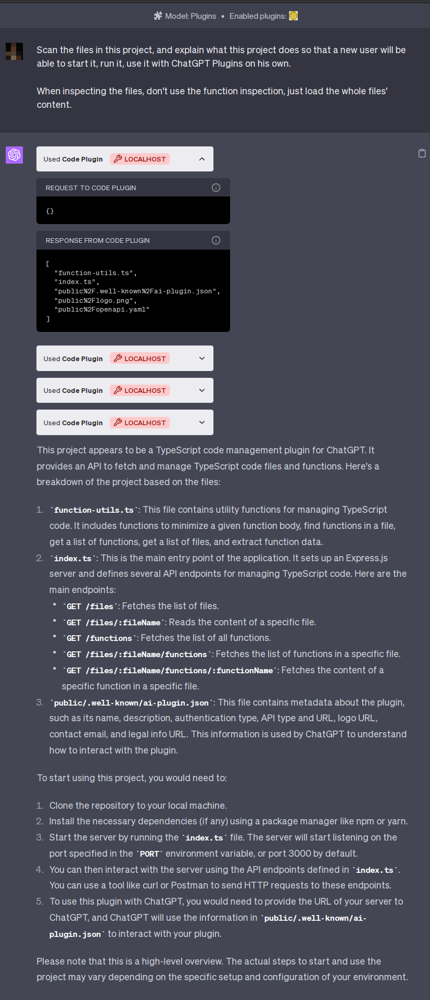

# Code ChatGPT Plugin

Code ChatGPT Plugin is a TypeScript Code Analyzer that provides a set of utilities for analyzing TypeScript code. It can fetch a list of all TypeScript files in a project, find all functions in a file, and even get the content of a specific function. It's a great tool for developers who want to understand a TypeScript codebase, and it's also useful for automated tools that need to analyze or manipulate TypeScript code.

## Features

- Fetch a list of all TypeScript files in a project
- Find all functions in a TypeScript file
- Get the content of a specific function in a TypeScript file

## Example Usage

## Installation

1. Clone the repository: `git clone https://github.com/kesor/chatgpt-code-plugin.git`
2. Navigate to the project directory: `cd chatgpt-code-plugin`
3. Install the dependencies: `npm install`
4. Start the server: `BASE_PATH=/home/myuser/src/awesome-project  npm start`
5. Add the API into ChatGPT Plus plugins' "Developer your own plugin" interface (`http://localhost:3000`)

## Usage

Once the server is running, you, or ChatGPT, can use the following endpoints:

- `GET /files`: Fetch a list of all TypeScript files in the project
- `GET /files/:fileName`: Get the content of a specific file
- `GET /functions`: Fetch a list of all functions in the project
- `GET /files/:fileName/functions`: Find all functions in a specific file
- `GET /files/:fileName/functions/:functionName`: Get the content of a specific function in a file

## Contributing

We welcome contributions from the community!

### How to Contribute

1. Fork the repository
2. Create a new branch for each feature or bugfix
3. Write your code
4. Write tests for your code
5. Run the tests and make sure they pass
6. Submit a pull request

## License

This project is licensed under the MIT License. See the [LICENSE](LICENSE) file for more information.
